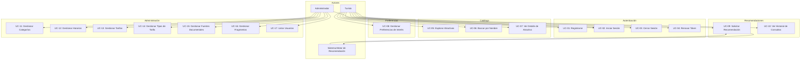

# Casos de Uso — Sistema Turístico La Paz

```mermaid
flowchart TB
    subgraph Actores
        T[Turista]
        A[Administrador]
        S[Sistema Motor de Recomendación]
    end

    subgraph Autenticación
        UC1[UC-01: Registrarse]
        UC2[UC-02: Iniciar Sesión]
        UC3[UC-03: Cerrar Sesión]
        UC4[UC-04: Renovar Token]
    end

    subgraph Catálogo
        UC5[UC-05: Explorar Atractivos]
        UC6[UC-06: Buscar por Nombre]
        UC7[UC-07: Ver Detalle de Atractivo]
    end

    subgraph Preferencias
        UC8[UC-08: Gestionar Preferencias de Interés]
    end

    subgraph Recomendaciones
        UC9[UC-09: Solicitar Recomendación]
        UC10[UC-10: Ver Historial de Consultas]
    end

    subgraph Administración
        UC11[UC-11: Gestionar Categorías]
        UC12[UC-12: Gestionar Horarios]
        UC13[UC-13: Gestionar Tarifas]
        UC14[UC-14: Gestionar Tipos de Tarifa]
        UC15[UC-15: Gestionar Fuentes Documentales]
        UC16[UC-16: Gestionar Fragmentos]
        UC17[UC-17: Listar Usuarios]
    end

    T --> UC1
    T --> UC2
    T --> UC3
    T --> UC4
    T --> UC5
    T --> UC6
    T --> UC7
    T --> UC8
    T --> UC9
    T --> UC10

    A --> UC2
    A --> UC11
    A --> UC12
    A --> UC13
    A --> UC14
    A --> UC15
    A --> UC16
    A --> UC17

    UC9 --> S
    S --> UC9
```
