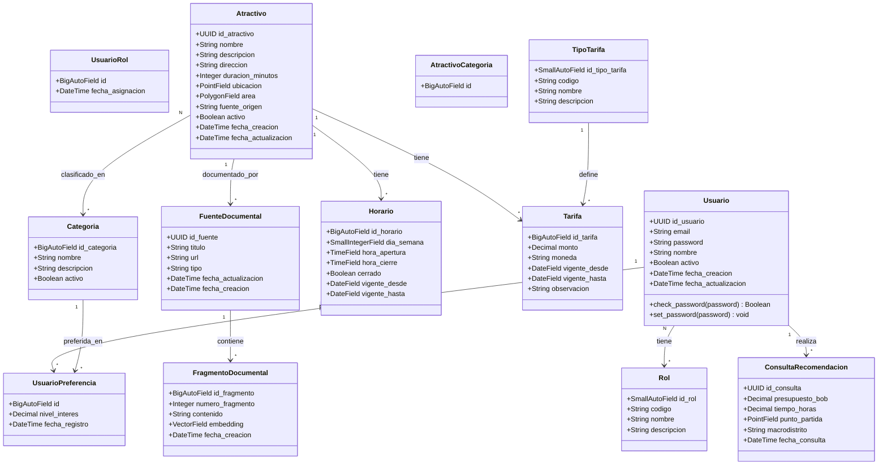

# Diagrama de Clases — Sistema Turístico La Paz

```mermaid
classDiagram
    class Usuario {
        +UUID id_usuario
        +String email
        +String password
        +String nombre
        +Boolean activo
        +DateTime fecha_creacion
        +DateTime fecha_actualizacion
        +check_password(password) Boolean
        +set_password(password) void
    }

    class Rol {
        +SmallAutoField id_rol
        +String codigo
        +String nombre
        +String descripcion
    }

    class UsuarioRol {
        +BigAutoField id
        +DateTime fecha_asignacion
    }

    class Atractivo {
        +UUID id_atractivo
        +String nombre
        +String descripcion
        +String direccion
        +Integer duracion_minutos
        +PointField ubicacion
        +PolygonField area
        +String fuente_origen
        +Boolean activo
        +DateTime fecha_creacion
        +DateTime fecha_actualizacion
    }

    class Categoria {
        +BigAutoField id_categoria
        +String nombre
        +String descripcion
        +Boolean activo
    }

    class AtractivoCategoria {
        +BigAutoField id
    }

    class Horario {
        +BigAutoField id_horario
        +SmallIntegerField dia_semana
        +TimeField hora_apertura
        +TimeField hora_cierre
        +Boolean cerrado
        +DateField vigente_desde
        +DateField vigente_hasta
    }

    class TipoTarifa {
        +SmallAutoField id_tipo_tarifa
        +String codigo
        +String nombre
        +String descripcion
    }

    class Tarifa {
        +BigAutoField id_tarifa
        +Decimal monto
        +String moneda
        +DateField vigente_desde
        +DateField vigente_hasta
        +String observacion
    }

    class FuenteDocumental {
        +UUID id_fuente
        +String titulo
        +String url
        +String tipo
        +DateTime fecha_actualizacion
        +DateTime fecha_creacion
    }

    class FragmentoDocumental {
        +BigAutoField id_fragmento
        +Integer numero_fragmento
        +String contenido
        +VectorField embedding
        +DateTime fecha_creacion
    }

    class UsuarioPreferencia {
        +BigAutoField id
        +Decimal nivel_interes
        +DateTime fecha_registro
    }

    class ConsultaRecomendacion {
        +UUID id_consulta
        +Decimal presupuesto_bob
        +Decimal tiempo_horas
        +PointField punto_partida
        +String macrodistrito
        +DateTime fecha_consulta
    }

    Usuario "N" --> "*" Rol : tiene
    Usuario "1" --> "*" UsuarioPreferencia : posee
    Usuario "1" --> "*" ConsultaRecomendacion : realiza
    Atractivo "N" --> "*" Categoria : clasificado_en
    Atractivo "1" --> "*" Horario : tiene
    Atractivo "1" --> "*" Tarifa : tiene
    Atractivo "1" --> "*" FuenteDocumental : documentado_por
    TipoTarifa "1" --> "*" Tarifa : define
    FuenteDocumental "1" --> "*" FragmentoDocumental : contiene
    Categoria "1" --> "*" UsuarioPreferencia : preferida_en
```
