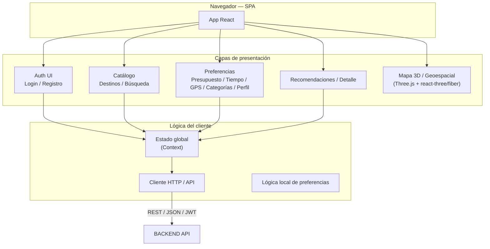

# Arquitectura del Frontend

Diagrama interno del frontend web (React + Vite + TailwindCSS + Three.js).

```mermaid
flowchart TB
    subgraph Browser["Navegador — SPA"]
        app["App React"]
    end

    subgraph UI["Capas de presentación"]
        auth_ui["Auth UI<br/>Login / Registro"]
        catalogo["Catálogo<br/>Destinos / Búsqueda"]
        preferencias["Preferencias<br/>Presupuesto / Tiempo / GPS / Categorías / Perfil"]
        recos["Recomendaciones / Detalle"]
        mapa["Mapa 3D / Geoespacial<br/>(Three.js + react-three/fiber)"]
    end

    subgraph Logica["Lógica del cliente"]
        api["Cliente HTTP / API"]
        estado["Estado global<br/>(Context)"]
        reco_local["Lógica local de preferencias"]
    end

    app --> auth_ui
    app --> catalogo
    app --> preferencias
    app --> recos
    app --> mapa

    auth_ui --> estado
    catalogo --> estado
    preferencias --> estado
    recos --> estado

    estado --> api
    api -- "REST / JSON / JWT" --> Backend["BACKEND API"]
```