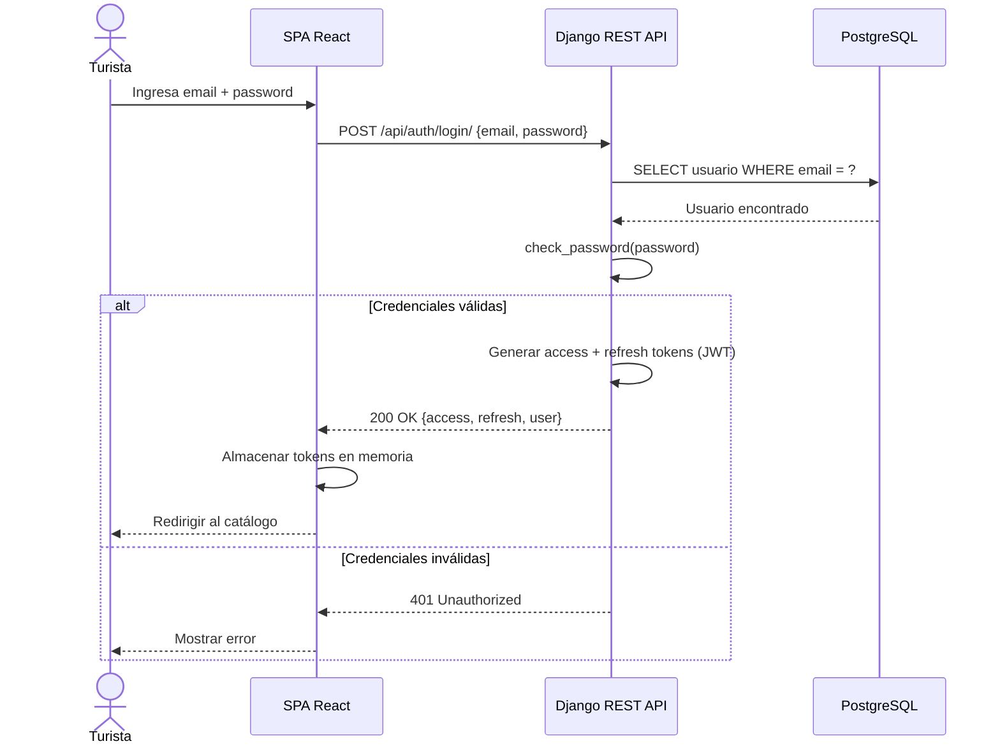
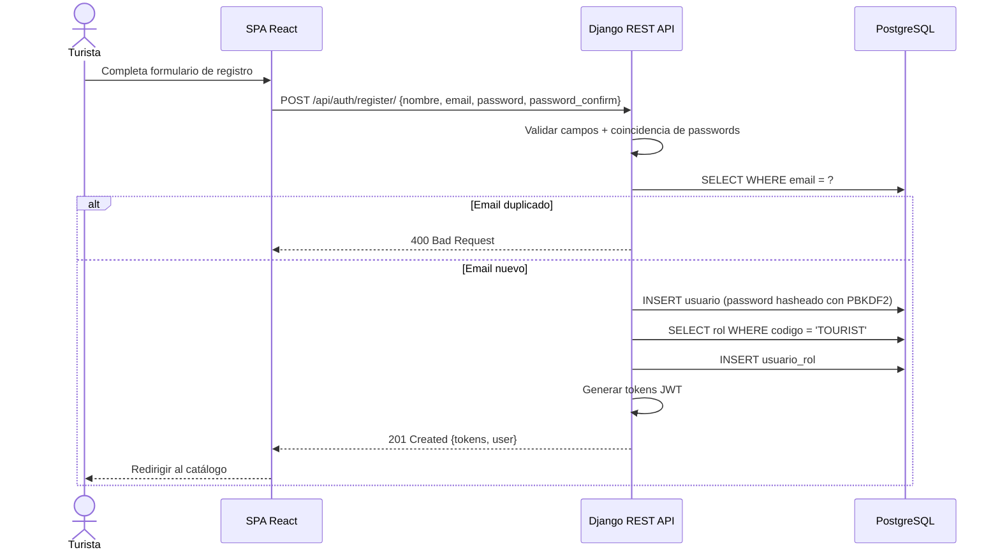
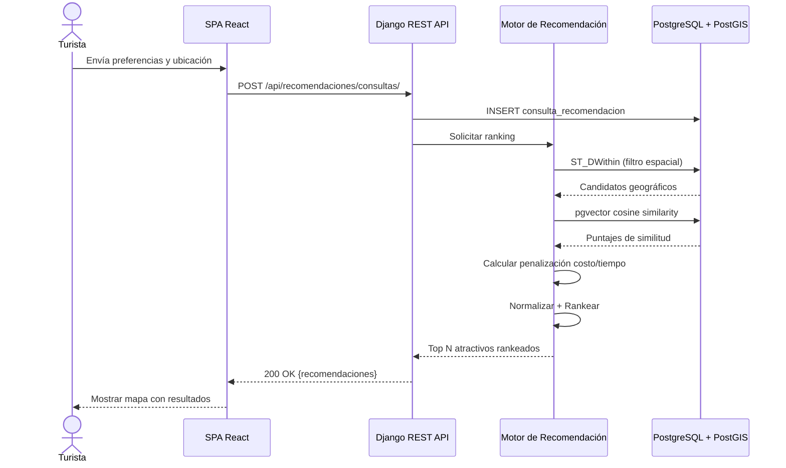

# Diagrama de Secuencia — Login JWT

```mermaid
sequenceDiagram
    actor Turista
    participant Frontend as SPA React
    participant API as Django REST API
    participant DB as PostgreSQL

    Turista->>Frontend: Ingresa email + password
    Frontend->>API: POST /api/auth/login/ {email, password}
    API->>DB: SELECT usuario WHERE email = ?
    DB-->>API: Usuario encontrado
    API->>API: check_password(password)
    alt Credenciales válidas
        API->>API: Generar access + refresh tokens (JWT)
        API-->>Frontend: 200 OK {access, refresh, user}
        Frontend->>Frontend: Almacenar tokens en memoria
        Frontend-->>Turista: Redirigir al catálogo
    else Credenciales inválidas
        API-->>Frontend: 401 Unauthorized
        Frontend-->>Turista: Mostrar error
    end
```

# Diagrama de Secuencia — Registro con Rol TOURIST

```mermaid
sequenceDiagram
    actor Turista
    participant Frontend as SPA React
    participant API as Django REST API
    participant DB as PostgreSQL

    Turista->>Frontend: Completa formulario de registro
    Frontend->>API: POST /api/auth/register/ {nombre, email, password, password_confirm}
    API->>API: Validar campos + coincidencia de passwords
    API->>DB: SELECT WHERE email = ?
    alt Email duplicado
        API-->>Frontend: 400 Bad Request
    else Email nuevo
        API->>DB: INSERT usuario (password hasheado con PBKDF2)
        API->>DB: SELECT rol WHERE codigo = 'TOURIST'
        API->>DB: INSERT usuario_rol
        API->>API: Generar tokens JWT
        API-->>Frontend: 201 Created {tokens, user}
        Frontend-->>Turista: Redirigir al catálogo
    end
```

# Diagrama de Secuencia — Solicitud de Recomendación

```mermaid
sequenceDiagram
    actor Turista
    participant Frontend as SPA React
    participant API as Django REST API
    participant Recomendador as Motor de Recomendación
    participant DB as PostgreSQL + PostGIS

    Turista->>Frontend: Envía preferencias y ubicación
    Frontend->>API: POST /api/recomendaciones/consultas/
    API->>DB: INSERT consulta_recomendacion
    API->>Recomendador: Solicitar ranking
    Recomendador->>DB: ST_DWithin (filtro espacial)
    DB-->>Recomendador: Candidatos geográficos
    Recomendador->>DB: pgvector cosine similarity
    DB-->>Recomendador: Puntajes de similitud
    Recomendador->>Recomendador: Calcular penalización costo/tiempo
    Recomendador->>Recomendador: Normalizar + Rankear
    Recomendador-->>API: Top N atractivos rankeados
    API-->>Frontend: 200 OK {recomendaciones}
    Frontend-->>Turista: Mostrar mapa con resultados
```
