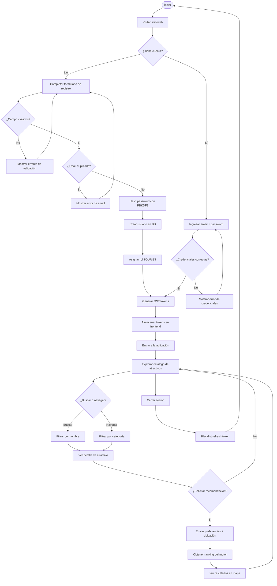

# Diagrama de Actividades — Flujo de Registro y Login

```mermaid
flowchart TB
    Start([Inicio]) --> VisitSite[Visitar sitio web]
    VisitSite --> HasAccount{¿Tiene cuenta?}

    HasAccount -->|No| Register[Completar formulario de registro]
    Register --> ValidateFields{¿Campos válidos?}
    ValidateFields -->|No| ShowRegError[Mostrar errores de validación]
    ShowRegError --> Register
    ValidateFields -->|Sí| CheckDuplicate{¿Email duplicado?}
    CheckDuplicate -->|Sí| ShowDupError[Mostrar error de email]
    ShowDupError --> Register
    CheckDuplicate -->|No| HashPassword[Hash password con PBKDF2]
    HashPassword --> CreateUsuario[Crear usuario en BD]
    CreateUsuario --> AssignRole[Asignar rol TOURIST]
    AssignRole --> GenTokens[Generar JWT tokens]
    GenTokens --> StoreTokens[Almacenar tokens en frontend]
    StoreTokens --> EnterApp[Entrar a la aplicación]

    HasAccount -->|Sí| Login[Ingresar email + password]
    Login --> ValidateCreds{¿Credenciales correctas?}
    ValidateCreds -->|No| ShowLoginError[Mostrar error de credenciales]
    ShowLoginError --> Login
    ValidateCreds -->|Sí| GenTokens

    EnterApp --> Explore[Explorar catálogo de atractivos]
    Explore --> Search{¿Buscar o navegar?}
    Search -->|Buscar| SearchByName[Filtrar por nombre]
    Search -->|Navegar| BrowseCategories[Filtrar por categoría]
    SearchByName --> ViewDetail[Ver detalle de atractivo]
    BrowseCategories --> ViewDetail

    ViewDetail --> WantRec{¿Solicitar recomendación?}
    WantRec -->|No| Explore
    WantRec -->|Sí| SendPrefs[Enviar preferencias + ubicación]
    SendPrefs --> GetRecommendations[Obtener ranking del motor]
    GetRecommendations --> ViewResults[Ver resultados en mapa]
    ViewResults --> Explore

    Explore --> Logout[Cerrar sesión]
    Logout --> BlacklistToken[Blacklist refresh token]
    BlacklistToken --> Start
```

# Diagrama de Actividades — Motor de Recomendación

```mermaid
flowchart LR
    Start([Consulta]) --> Input[Recibir perfil + GPS]
    Input --> SpatialFilter[Filtro espacial PostGIS ST_DWithin]
    SpatialFilter --> Distance[Calcular distancia ST_Distance]
    Distance --> Similarity[Similitud pgvector cosine]
    Similarity --> CostTime[Penalización costo/tiempo]
    CostTime --> Normalize[Normalización min-max]
    Normalize --> Rank[Rankeo ponderado]
    Rank --> Cutoff[Filtrar top N]
    Cutoff --> Output([Lista ordenada])
```
