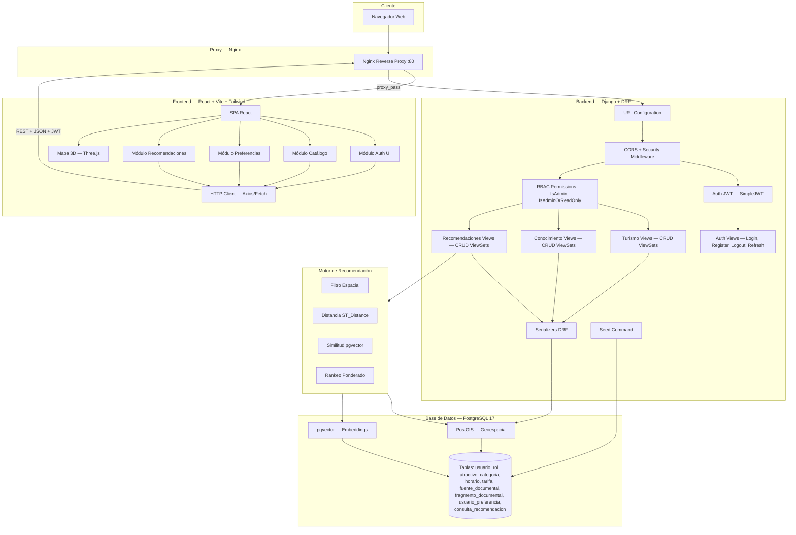

# Diagrama de Componentes — Sistema Turístico La Paz

```mermaid
flowchart TB
    subgraph Cliente
        Browser[Navegador Web]
    end

    subgraph Frontend["Frontend — React + Vite + Tailwind"]
        SPA[SPA React]
        AuthUI[Módulo Auth UI]
        Catalogo[Módulo Catálogo]
        Preferencias[Módulo Preferencias]
        RecomendacionesUI[Módulo Recomendaciones]
        Mapa3D[Mapa 3D — Three.js]
        HTTPClient[HTTP Client — Axios/Fetch]
    end

    subgraph Proxy["Proxy — Nginx"]
        Nginx[Nginx Reverse Proxy :80]
    end

    subgraph Backend["Backend — Django + DRF"]
        URLConf[URL Configuration]
        Middleware[CORS + Security Middleware]
        AuthJWT[Auth JWT — SimpleJWT]
        RBAC[RBAC Permissions — IsAdmin, IsAdminOrReadOnly]
        ViewsTurismo[Turismo Views — CRUD ViewSets]
        ViewsConocimiento[Conocimiento Views — CRUD ViewSets]
        ViewsRecomendaciones[Recomendaciones Views — CRUD ViewSets]
        ViewsAuth[Auth Views — Login, Register, Logout, Refresh]
        Serializers[Serializers DRF]
        SeedCommand[Seed Command]
    end

    subgraph Database["Base de Datos — PostgreSQL 17"]
        PostGIS[PostGIS — Geoespacial]
        pgvector[pgvector — Embeddings]
        Tables[(Tablas: usuario, rol, atractivo, categoria,\nhorario, tarifa, fuente_documental,\nfragmento_documental, usuario_preferencia,\nconsulta_recomendacion)]
    end

    subgraph MotorRecomendacion["Motor de Recomendación"]
        FiltroEspacial[Filtro Espacial]
        Distancia[Distancia ST_Distance]
        Similitud[Similitud pgvector]
        Rankeo[Rankeo Ponderado]
    end

    Browser --> Nginx
    Nginx --> SPA
    SPA --> AuthUI
    SPA --> Catalogo
    SPA --> Preferencias
    SPA --> RecomendacionesUI
    SPA --> Mapa3D
    AuthUI --> HTTPClient
    Catalogo --> HTTPClient
    Preferencias --> HTTPClient
    RecomendacionesUI --> HTTPClient
    HTTPClient -->|REST + JSON + JWT| Nginx
    Nginx -->|proxy_pass| URLConf
    URLConf --> Middleware
    Middleware --> AuthJWT
    Middleware --> RBAC
    AuthJWT --> ViewsAuth
    RBAC --> ViewsTurismo
    RBAC --> ViewsConocimiento
    RBAC --> ViewsRecomendaciones
    ViewsTurismo --> Serializers
    ViewsConocimiento --> Serializers
    ViewsRecomendaciones --> Serializers
    Serializers --> PostGIS
    PostGIS --> Tables
    pgvector --> Tables
    SeedCommand --> Tables
    ViewsRecomendaciones --> MotorRecomendacion
    MotorRecomendacion --> PostGIS
    MotorRecomendacion --> pgvector
```
