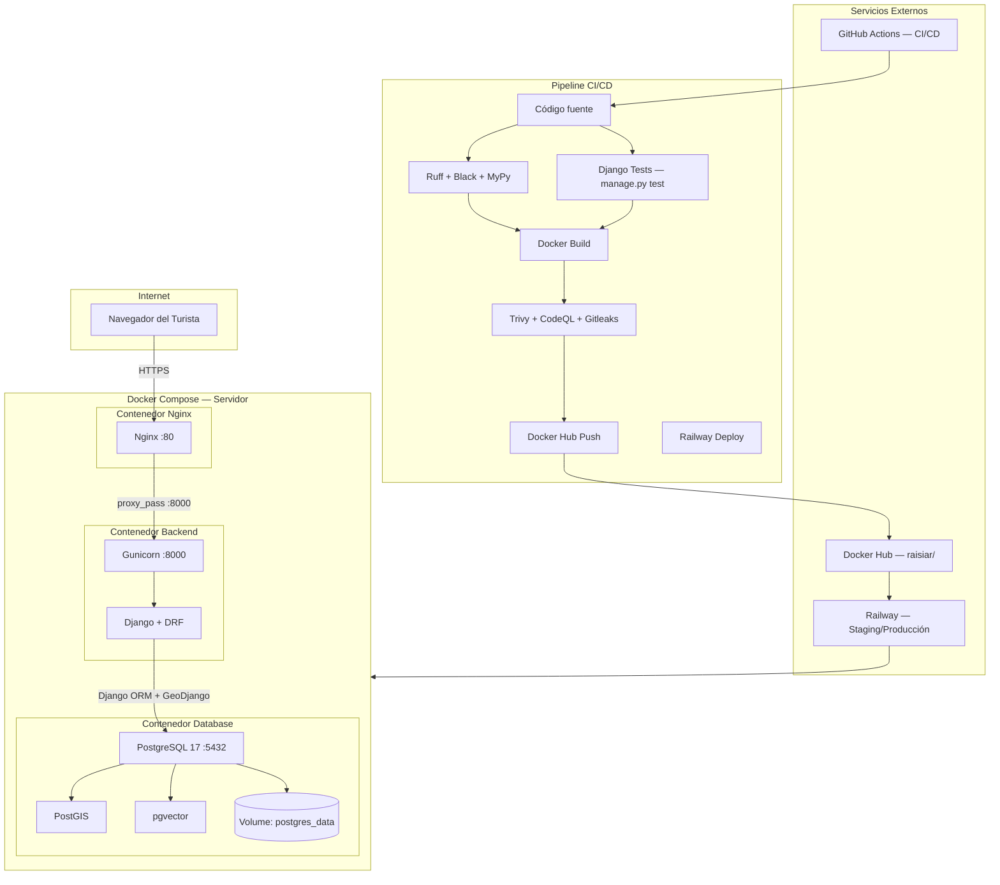

# Diagrama de Despliegue — Sistema Turístico La Paz

```mermaid
flowchart TB
    subgraph Internet
        User[Navegador del Turista]
    end

    subgraph Docker["Docker Compose — Servidor"]
        subgraph NginxContainer["Contenedor Nginx"]
            Nginx[Nginx :80]
        end

        subgraph BackendContainer["Contenedor Backend"]
            Gunicorn[Gunicorn :8000]
            Django[Django + DRF]
        end

        subgraph DBContainer["Contenedor Database"]
            PostgreSQL[PostgreSQL 17 :5432]
            PostGIS[PostGIS]
            pgvectorExt[pgvector]
            Volume[(Volume: postgres_data)]
        end
    end

    subgraph External["Servicios Externos"]
        DockerHub[Docker Hub — raisiar/]
        Railway[Railway — Staging/Producción]
        GitHub[GitHub Actions — CI/CD]
    end

    subgraph CI["Pipeline CI/CD"]
        Checkout[Código fuente]
        Lint[Ruff + Black + MyPy]
        Tests[Django Tests — manage.py test]
        Build[Docker Build]
        Security[Trivy + CodeQL + Gitleaks]
        Push[Docker Hub Push]
        Deploy[Railway Deploy]
    end

    User -->|HTTPS| Nginx
    Nginx -->|proxy_pass :8000| Gunicorn
    Gunicorn --> Django
    Django -->|Django ORM + GeoDjango| PostgreSQL
    PostgreSQL --> PostGIS
    PostgreSQL --> pgvectorExt
    PostgreSQL --> Volume

    GitHub --> Checkout
    Checkout --> Lint
    Checkout --> Tests
    Lint --> Build
    Tests --> Build
    Build --> Security
    Security --> Push
    Push --> DockerHub
    DockerHub --> Railway
    Railway --> Docker
```
