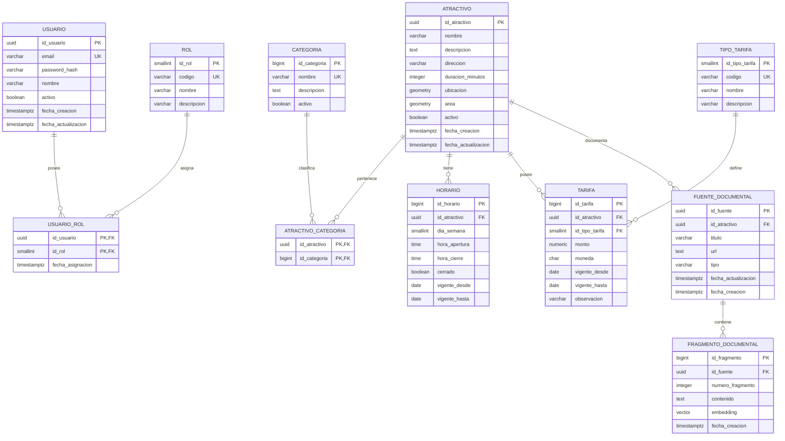

# Diseño del Modelo de Datos Relacional y Geoespacial

## Sistema Web Informativo para la Guía Personalizada de Destinos Turísticos en La Paz

### Issue relacionado

**#5 - Diseñar Modelo de Datos Relacional y Geoespacial**

---

## 1. Objetivo

Diseñar el modelo de datos conceptual y físico del sistema turístico, definiendo las entidades, relaciones, llaves primarias, llaves foráneas e índices necesarios para soportar:

- Usuarios.
- Roles y control de acceso.
- Catálogo de atractivos turísticos.
- Categorías.
- Horarios.
- Tarifas.
- Coordenadas geográficas.
- Geometrías espaciales mediante PostGIS.
- Fuentes documentales para RAG.
- Fragmentos documentales y embeddings mediante pgvector.

El modelo se diseña sobre PostgreSQL y contempla el uso de PostGIS para consultas geoespaciales y pgvector para búsquedas por similitud vectorial.

---

## 2. Tecnologías de persistencia

| Componente | Tecnología |
|---|---|
| Motor de base de datos | PostgreSQL |
| Datos geoespaciales | PostGIS |
| Almacenamiento vectorial | pgvector |
| Identificadores principales | UUID / BIGSERIAL |
| Coordenadas geográficas | EPSG:4326 - WGS84 |
| Índices espaciales | GiST |
| Índice vectorial propuesto | HNSW |
| Métrica vectorial propuesta | Distancia coseno |
| Moneda principal | BOB |

> **Nota de implementación**: el esquema físico lo gestiona Django mediante
> migraciones (`backend/turismo/migrations/`), que crean extensiones
> (PostGIS, pgvector), tablas, restricciones e índices al ejecutar
> `manage.py migrate`. No se aplica SQL de arranque en el volúmen de BD.

---

## 3. Diagrama Entidad-Relación Conceptual



---

## 4. Relaciones y cardinalidades

| Entidad origen | Relación | Entidad destino | Cardinalidad |
|---|---|---|---|
| Usuario | posee | Rol | N:M |
| Atractivo | pertenece | Categoría | N:M |
| Atractivo | tiene | Horario | 1:N |
| Atractivo | posee | Tarifa | 1:N |
| Tipo de tarifa | clasifica | Tarifa | 1:N |
| Atractivo | posee | Fuente documental | 1:N |
| Fuente documental | contiene | Fragmento documental | 1:N |

---

## 5. Criterios de normalización

El modelo se diseña siguiendo los principios de normalización hasta Tercera Forma Normal (3FN).

### Primera Forma Normal (1FN)

Cada atributo contiene valores atómicos. No se almacenan listas de categorías, horarios o tarifas dentro de una sola columna.

### Segunda Forma Normal (2FN)

Las tablas asociativas `usuario_rol` y `atractivo_categoria` utilizan claves primarias compuestas y sus atributos dependen de la totalidad de dichas claves.

> En el modelo físico de Django estas tablas usan un `id` sintético como
> clave primaria más una restricción `UNIQUE (fk_origen, fk_destino)`, porque
> el ORM de Django no soporta claves primarias compuestas. La unicidad
> funcional es idéntica.

### Tercera Forma Normal (3FN)

La información relacionada con roles, categorías y tipos de tarifa se encuentra separada en entidades independientes, evitando redundancia y dependencias transitivas.

---

## 6. Diseño geoespacial

La ubicación principal de cada atractivo turístico se representa mediante:

```sql
GEOMETRY(Point, 4326)
```

Cuando un atractivo requiera representar un área geográfica se podrá utilizar:

```sql
GEOMETRY(Polygon, 4326)
```

Se adopta el sistema de referencia:

```text
EPSG:4326 - WGS84
```

PostGIS representa un punto utilizando el orden:

```text
POINT(longitud latitud)
```

Ejemplo:

```text
POINT(-68.1193 -16.4897)
```

Los campos espaciales utilizarán índices GiST para optimizar consultas por distancia, radio, intersección y pertenencia geográfica.

---

## 7. Embeddings y búsqueda vectorial

Los embeddings serán almacenados mediante la extensión `pgvector`.

Tipo propuesto:

```sql
VECTOR(1536)
```

La dimensión `1536` es una propuesta inicial y deberá confirmarse de acuerdo con el modelo de embeddings seleccionado por el equipo.

Para búsquedas semánticas se propone utilizar distancia coseno mediante:

```sql
vector_cosine_ops
```

y un índice vectorial HNSW.
